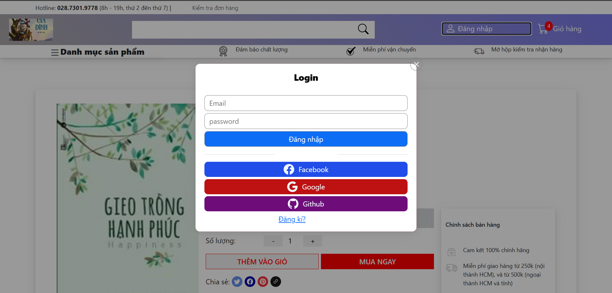
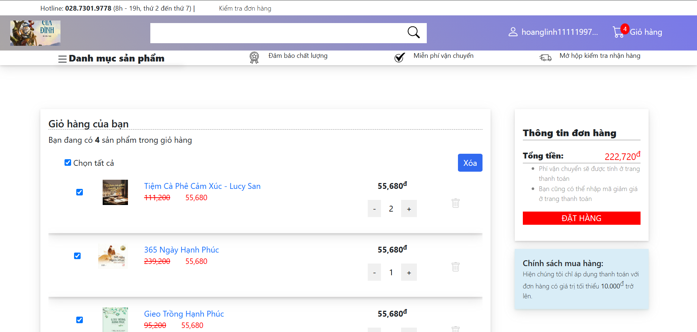
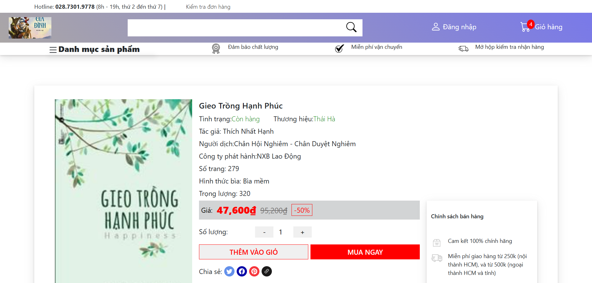
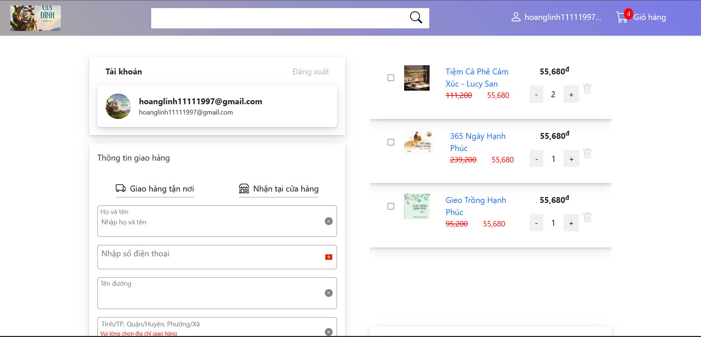
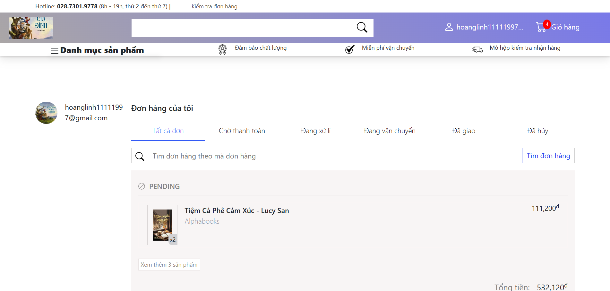

<h1 align="center">
📚 Online Book Store
</h1>

<p align="center">
Online Book Store được xây dựng bằng Springboot và React
</p>

<p align="center">
  
  
  
  
</p>

# 📑 Table of Contents

- [Giới thiệu](#gioi-thieu)
- [Công nghệ](#cong-nghe)
- [Kiến trúc hệ thống](#kien-truc)
- [Chức năng](#chuc-nang)
- [Screenshots](#screenshots)
- [Cài đặt](#cai-dat)
- [Database](#csdl)

<a id="gioi-thieu"></a>
# 📖 Giới thiệu

Dự án online bookstore system.

Người dùng có thể thực hiện:

- Đăng nhập bằng google account
- Đăng xuất
- Tìm kiếm sách
- Thêm sách vào giỏ hàng
- Đặt hàng
- Xem lịch sử đơn hàng

<a id="cong-nghe"></a>
# 🛠 Công nghệ
## Backend

- Java 21
- Spring Boot
- Spring Security
- Spring Data JPA
- JWT Authentication
- Maven

## Frontend

- React
- TypeScript
- React Router
- Axios
- Bootstrap icons
- HTML & CSS

## Database

- PostpreSQL

<a id="kien-truc"></a>
# 🏗 Kiến trúc hệ thống

```text
Browser
   ↓
React
   ↓ REST API
Spring Boot
   ↓
PostgreSQL
```

<a id="chuc-nang"></a>
# ✨ Chức năng
## User

- Đăng nhập bằng tài khoản google
- Hiển thị sách
- Hiển thị chi tiết sách
- Tìm kiếm sách
- Thêm sách vào giỏ hàng
- Đặt hàng
- Xem lịch sử mua hàng
- Hiển thị danh sách tỉnh huyện xã thông qua external API
- Tính phí Ship thông qua external API
#### 🔗 External APIs

##### Vietnam Administrative Division API

APi dùng để lấy dữ liệu tỉnh, huyện, xã:

- https://provinces.open-api.vn/

Mục đích:
- Chọn địa chỉ động thông qua quá trình thanh toán.
- Cải thiện trải nghiệm người dùng dựa trên shipping form.

##### GHN API (Giao Hàng Nhanh)

Api dùng để tính phí ship:

- https://api.ghn.vn/

Mục đích:
- Tính phí ship dựa trên địa chỉ người dùng cung cấp.
- Hỗ trợ quy trình thanh toán đơn hàng.

<a id="screenshots"></a>
# 📷 Screenshots

## Trang chủ


## Trang Login



## Trang giỏ hàng



## Trang chi tiết sản phẩm



## Trang thanh toán



## Trang lịch sử mua hàng



<a id="cai-dat"></a>
# ⚙️ Cài đặt

## Clone Project

```bash
git clone https://github.com/yourname/book-store.git
```

## 🗄 Database

Tạo database:

```PostgreSql
CREATE DATABASE Bookstore;
```

Cập nhật application.properties:
```
spring.datasource.url= your_db_url
spring.datasource.username= your_usname
spring.datasource.password= your_password
```
## Google_Account
1. Đăng kí Google Client ID / Secret tại:
```
https://console.cloud.google.com/
```
2. Cập nhật application.properties:
```
spring.security.oauth2.client.registration.google.client-id: your_client_id
spring.security.oauth2.client.registration.google.client-secret: your_client_secret
```
## GHN_Account
1. Đăng kí tài khoản GHN
```
https://sso.ghn.vn/v2/ssoLogin
```
Dựa vào hướng dẫn sau:

```
https://api.ghn.vn/home/docs/detail
```
Cập nhật application.properties:
```
ghn.token:your_token
ghn.shop_id:your_shop_id
ghn.from-district-id:your_store_district_id
ghn.from-ward-code:your_store_ward_code
```

## Backend

```bash
cd backend

mvn clean install

mvn spring-boot:run
```

## Frontend

```bash
cd frontend

npm install

npm run dev
```
